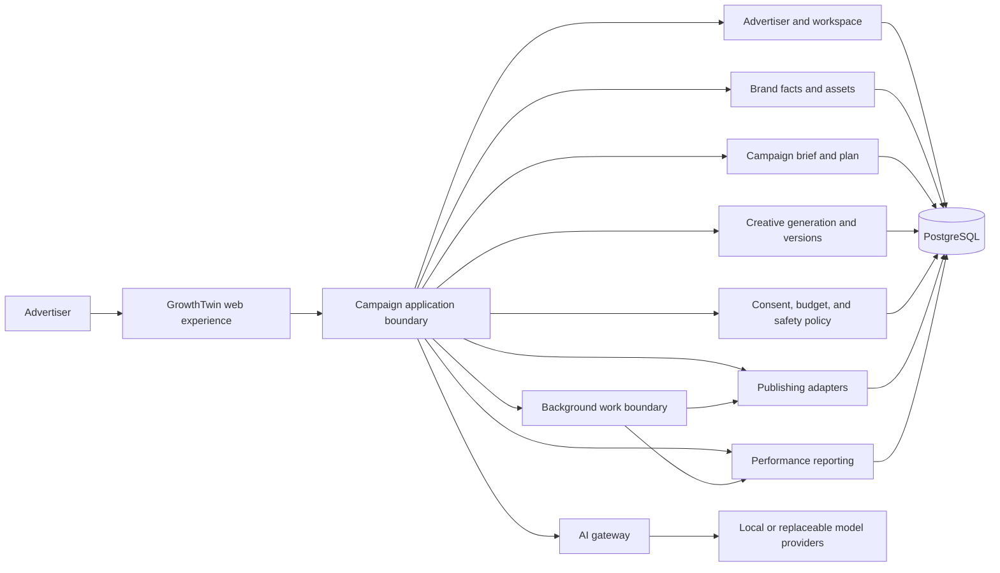

# GrowthTwin architecture

Status: the product objective is a user-authorized advertising autopilot. The accepted modular-monolith and Django/PostgreSQL decisions remain in [ADR-0001](docs/adr/0001-modular-monolith.md) and [ADR-0002](docs/adr/0002-application-stack-and-local-environment.md). No production AI provider or publishing platform is selected.

## Product boundary

GrowthTwin receives a plain-language campaign request from an individual, creator, or business, produces and validates campaign assets, publishes and measures them through an authorized destination, and reports results. The ordinary journey should not need a GrowthTwin staff operator. The advertiser initiates the work, connects the destination, and configures the permitted channels, schedule, content boundaries, and spend caps. Application rules enforce those limits; incomplete or unsafe cases pause and explain what is needed.

The website should reduce user effort by asking only for missing essential facts, showing progress in plain language, and keeping preview, limits, and stop controls visible. Dental-clinic examples are a potential pilot dataset, not a domain boundary.

Local UX and campaign prototypes may proceed with synthetic data before Phase 0 staging/recovery checks are complete. Staging E2E, backup/restore, rollback, and production readiness remain gates before real account connections, an external beta, or production activity.

## Proposed shape

Start with one modular Django application and PostgreSQL. Add a separate worker or service only when the local product slice demonstrates a need and the cost and operations are reviewed.

The diagram is a logical view, not a deployment topology. It does not require a separate worker, new database, or third-party AI provider.

## Module responsibilities

- **Web experience:** low-friction, responsive campaign intake, previews, progress, reports, and pause/stop controls.
- **Advertiser and workspace:** accounts, memberships, tenant context, and connected destinations. Enforce authorization on the server for every read and write.
- **Brand facts and assets:** advertiser-supplied facts, references, permitted claims, and reusable creative inputs.
- **Campaign brief and plan:** validated objective, audience, budget ceiling, schedule, destination, status, and required facts.
- **Creative generation and versions:** copy and media metadata, revisions, destination formatting, and traceability to the source brief.
- **Consent, budget, and safety policy:** accepted account scopes, per-campaign and aggregate spend ceilings, allowed schedules and content, stop conditions, and auditable decisions. Fail closed when state is missing or stale.
- **AI gateway:** server-side contract and replaceable providers for generation and checking. Outputs are untrusted suggestions and must pass deterministic schema and policy validation.
- **Publishing adapters:** provider-neutral external-action contract. Adapters own OAuth/token details, platform payloads, idempotency keys, failure mapping, and reconciliation. Only the application policy layer may authorize dispatch.
- **Performance reporting:** imports and normalizes platform results, marks missing or delayed data clearly, and presents understandable summaries.
- **Background work:** asynchronous generation, scheduling, publishing, and reporting with bounded retries and visible state. Select a queue or workflow product only after need and cost are established.
- **Persistence and operations:** transaction ownership, tenant-scoped records, health/readiness, revision visibility, audit metadata, backups, and recovery controls.

## Campaign lifecycle

`brief -> planned -> generated -> validated -> scheduled/paused -> published -> measured -> optimized/paused`

The advertiser first authorizes the connected destination and chooses hard limits. The normal path can proceed without a per-campaign staff approval when the request, content, account, schedule, and spend all fit that authorization. Missing facts, invalid output, unsafe or restricted content, provider uncertainty, and limit violations pause the campaign. A revised creative is always revalidated before dispatch. A prominent advertiser stop action disables future dispatch immediately.

An AI model must never set or raise a spend cap, invent advertiser facts, decide that policy checks passed, access platform credentials, or call a publishing API. Application code validates permissions and current limits at dispatch time, records the exact version and idempotency key, and reconciles uncertain provider responses before retrying.

## Architecture rules

1. Domain modules own their rules and expose application contracts; avoid cross-module database access and import cycles.
2. Enforce workspace/advertiser scoping at application and persistence boundaries.
3. External AI and publishing providers are server-side adapters. Never expose provider credentials to the browser or model.
4. Hosted trial models receive synthetic evaluation examples only and never serve GrowthTwin end users.
5. Verify platform permissions, terms, and reporting coverage before selecting an adapter for real use.
6. Keep budget, consent, validation, pause, and idempotency rules deterministic and testable.
7. Keep early product work in the existing application. Add infrastructure only when measured workflow needs justify it.

## Open architecture decisions

The first stack remains Django 5.2 LTS + PostgreSQL. The first advertising destination, authentication extensions, async job system, object/media storage, production host, and production AI provider remain open. Local product UX does not depend on resolving these choices; resolve each before the feature requires it and record it in an ADR.
