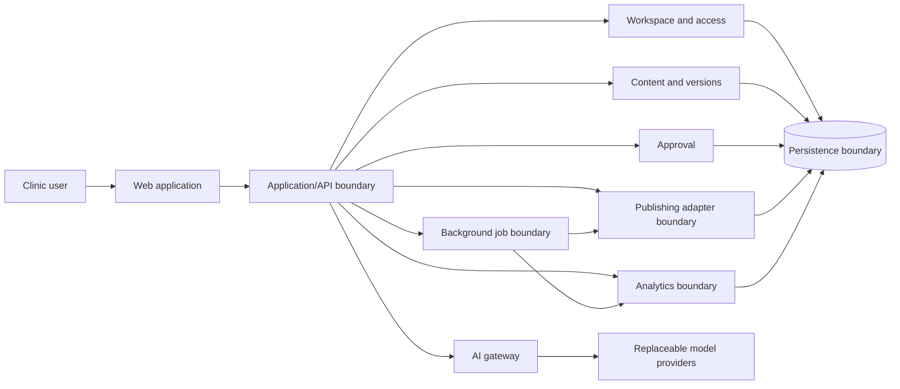

# GrowthTwin architecture (proposed)

Status: Phase 0 design proposal. This document defines boundaries, not an accepted programming language, framework, database, hosting provider, or vendor choice. Record those choices in an accepted ADR before implementation depends on them.

## Product boundary

GrowthTwin is intended to help a clinic workspace prepare social content, review it, publish it through supported platform integrations, and learn from resulting performance. A clinic user must approve the exact content version before any publishing action. AI output is a draft and never grants publishing authority.

Phase 0 validates the development workflow. Its only planned app is a synthetic-data demo profile-edit flow in M4. Clinic workflows, real social publishing, analytics, and production AI are outside Phase 0.

## Proposed shape

Start with a modular monolith: one product boundary with clearly owned modules and explicit interfaces. Add a separate worker or service only when a demonstrated operational need justifies it. Keep infrastructure and provider choices replaceable.

The diagram is a logical view, not a deployment topology. It does not require separate services or a particular database.

## Module responsibilities

- **Web application:** user-facing screens and session-aware requests; never owns authorization decisions or provider secrets.
- **Application/API boundary:** validates commands, coordinates use cases, applies authorization, and returns stable contracts to the web client.
- **Workspace and access:** clinic workspace membership, roles, and tenant context.
- **Content and versions:** campaign/content drafts, assets metadata, revisions, and the immutable content version proposed for approval.
- **Approval:** records who approved which exact version and when; any later content change invalidates that approval.
- **Publishing boundary:** provider-neutral commands and results. Platform adapters own external API details; dispatch only an approved version and make retries idempotent.
- **Analytics boundary:** imports and normalizes platform results without coupling content workflows to platform-specific reports.
- **AI gateway:** one application contract for generation and other model tasks, with replaceable adapters such as NVIDIA NIM for evaluation and local Ollama experiments. Apply data-handling rules before sending a request.
- **Background job boundary:** asynchronous work, retries, and status reporting. Choose a queue/workflow product only after a need and cost are established.
- **Persistence boundary:** storage contracts and transaction ownership. The implementation and database remain open decisions.
- **Operations:** configuration, health/readiness, structured logging, metrics, and deployment controls shared by the application.

## Key content lifecycle

`draft -> generated/edited -> submitted -> approved(version N) -> queued -> published -> measured`

An editor may change a draft at any point before dispatch; a changed version returns to review. The publishing adapter checks approval for the exact version at dispatch time. Failures remain visible and retryable without silently publishing a different version.

## Architecture rules

1. Domain modules own their rules and expose application-level contracts; avoid cross-module database access and import cycles.
2. Enforce workspace scoping at the application and persistence boundaries.
3. External providers are adapters behind interfaces. Provider-specific response formats must not leak into product workflows.
4. Hosted trial models receive synthetic evaluation examples only and are never a production serving path.
5. Keep background execution and object storage behind boundaries; do not provision them merely to match the reference architecture.
6. Do not implement product modules until Phase 0 is accepted and the user explicitly authorizes product work.

## Open architecture decisions

The initial application stack is accepted as Django 5.2 LTS + PostgreSQL (see [ADR-0002](docs/adr/0002-application-stack-and-local-environment.md)). The exact PostgreSQL major/minor and local installation method, authentication extensions, job runner, object storage, deployment host, CI checks, and production AI provider remain undecided. See [the ADR index](docs/adr/README.md) and [PROJECT.md](PROJECT.md).
